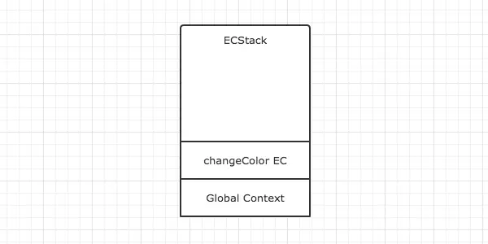
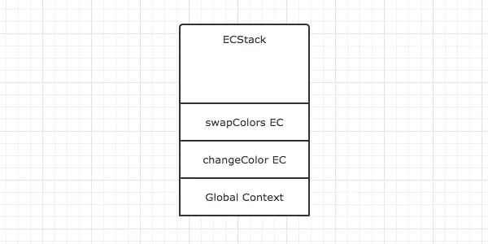
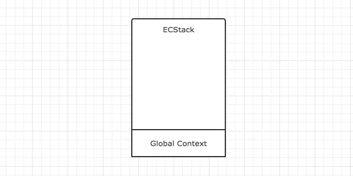

## 什么是执行上下文
执行上下文（Execution Context）是JavaScript中最基础，但同时也是最重要的一个概念。
<br>
每次当控制器转到可执行代码的时候，就会进入一个执行上下文。执行上下文可以理解为**当前代码的执行环境，它会形成一个作用域**。

## 运行环境

**JavaScript中的运行环境大概包括三种情况。**
* 全局环境：JavaScript代码运行起来会首先进入该环境
* 函数环境：当函数被调用执行时，会进入当前函数中执行代码
* eval（不建议使用，可忽略）

在一个JavaScript程序中，会产生多个执行上下文，并以栈的方式来处理它们。这个栈，我们称其为函数调用栈(call stack)。栈底永远都是全局上下文，而栈顶就是当前正在执行的上下文。
<br>
在代码在执行过程中，遇到以上三种情况，都会生成一个执行上下文放入栈中。而处于栈顶的上下文在执行完毕之后则会自动出栈。为了更加清晰的理解这个过程，根据下面的例子，结合图示给大家展示。

> 执行上下文可以理解为函数执行的环境，每一个函数执行时，都会给对应的函数创建这样一个执行环境。

## 执行上下文图解
为了更加清晰的理解这个过程，根据下面的例子，结合图示给大家展示。

```js
var color = 'blue';

function changeColor() {
    var anotherColor = 'red';
    function swapColors() {
        var tempColor = anotherColor;
        anotherColor = color;
        color = tempColor;
    }
    swapColors();
}

changeColor();
```

我们用ECStack来表示处理执行上下文组的堆栈。我们很容易知道，第一步，首先是全局上下文入栈。


全局上下文入栈之后，其中的可执行代码开始执行，直到遇到了changeColor()，这一句激活函数changeColor创建它自己的执行上下文，因此第二步就是changeColor的执行上下文入栈。



changeColor的上下文入栈之后，控制器开始执行其中的可执行代码，遇到swapColors()之后又激活了一个执行上下文。因此第三步是swapColors的执行上下文入栈。



在swapColors的可执行代码中，再没有遇到其他能生成执行上下文的情况，因此这段代码顺利执行完毕，swapColors的上下文从栈中弹出。


swapColors的执行上下文弹出之后，继续执行changeColor的可执行代码，也没有再遇到其他执行上下文，顺利执行完毕之后弹出。这样，ECStack中就只身下全局上下文了。



全局上下文在浏览器窗口关闭后出栈。

!> 注意：函数中，遇到return能直接终止可执行代码的执行，因此会直接将当前上下文弹出栈。


**详细了解了这个过程之后，我们就可以对执行上下文总结一些结论了。**
* 单线程
* 同步执行，只有栈顶的上下文处于执行中，其他上下文需要等待
* 全局上下文只有唯一的一个，它在浏览器关闭时出栈
* 函数的执行上下文的个数没有限制
* 每次某个函数被调用，就会有个新的执行上下文为其创建，即使是调用的自身函数，也是如此。

为了巩固一下执行上下文的理解，我们再来绘制一个例子的演变过程，这是一个简单的闭包例子。

```js
function f1(){
    var n=999;
    function f2(){
        alert(n);
    }
    return f2;
}
var result=f1();
result(); // 999
```

因为f1中的函数f2在f1的可执行代码中，并没有被调用执行，因此执行f1时，f2不会创建新的上下文，而直到result执行时，才创建了一个新的。具体演变过程如下。


?> 如果你在某公众号看到我的文章，然后发现下面的评论说最后一个例子错了，请不要管他们，他们把函数调用栈和作用域链没有分清楚就跑出来质疑，真的很有问题。建议大家读一读这系列的第六篇文章，教你如何自己拥有判断对错的能力。

最后留一个简单的例子，大家可以自己脑补一下这个例子在执行过程中执行上下文的变化情况。

```js
var name = "window";

var p = {
  name: 'Perter',
  getName: function() {

    // 利用变量保存的方式保证其访问的是p对象
    var self = this;
    return function() {
      return self.name;
    }
  }
}

var getName = p.getName();
var _name = getName();
console.log(_name);
```

## 执行上下文生命周期
当调用一个函数时（激活），一个新的执行上下文就会被创建。而一个执行上下文的生命周期可以分为两个阶段。

* 创建阶段<br>在这个阶段中，执行上下文会分别创建变量对象，建立作用域链，以及确定this的指向。

* 代码执行阶段<br>创建完成之后，就会开始执行代码，这个时候，会完成变量赋值，函数引用，以及执行其他代码。


?> 从这里我们就可以看出详细了解执行上下文极为重要，因为其中涉及到了变量对象，作用域链，this等很多人没有怎么弄明白，但是却极为重要的概念，它关系到我们能不能真正理解JavaScript。在后面的文章中我们会一一详细总结，这里我们先重点了解变量对象。