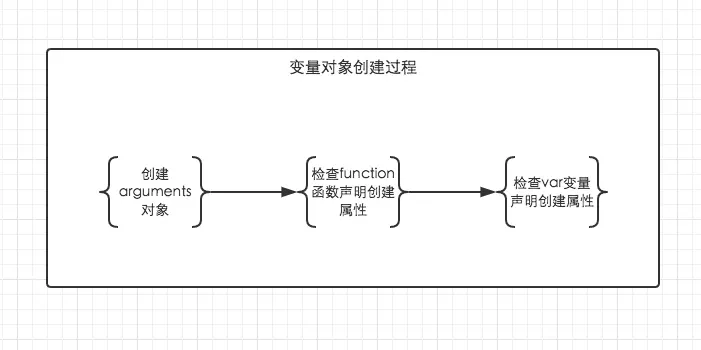

## 执行上下文生命周期回顾
当调用一个函数时（激活），一个新的执行上下文就会被创建。而一个执行上下文的生命周期可以分为两个阶段。

* 创建阶段<br>在这个阶段中，执行上下文会分别创建变量对象，建立作用域链，以及确定this的指向。

* 代码执行阶段<br>创建完成之后，就会开始执行代码，这个时候，会完成变量赋值，函数引用，以及执行其他代码。


## 变量对象（Variable Object）
变量对象的创建，依次经历了以下几个过程。

* 建立arguments对象。<br>检查当前上下文中的参数，建立该对象下的属性与属性值。

* 检查当前上下文的函数声明，也就是使用function关键字声明的函数。<br>在变量对象中以函数名建立一个属性，属性值为指向该函数所在内存地址的引用。如果函数名的属性已经存在，那么该属性将会被新的引用所覆盖。

* 检查当前上下文中的变量声明，每找到一个变量声明，就在变量对象中以变量名建立一个属性，属性值为undefined。<br>如果该变量名的属性已经存在，为了防止同名的函数被修改为undefined，则会直接跳过，原属性值不会被修改。

许多读者在阅读到这的时候会因为下面的这样场景对于“跳过”一词产生疑问。既然变量声明的foo遇到函数声明的foo会跳过，可是为什么最后foo的输出结果仍然是被覆盖了？

```js
function foo() { console.log('function foo') }
var foo = 20;

console.log(foo); // 20
```

其实只是大家在阅读的时候不够仔细，因为上面的三条规则仅仅适用于变量对象的创建过程。也就是执行上下文的创建过程。而foo = 20是在执行上下文的执行过程中运行的，输出结果自然会是20。对比下例。

```js
console.log(foo); // function foo
function foo() { console.log('function foo') }
var foo = 20;

// 上面的执行顺序为

// 首先将所有函数声明放入变量对象中
function foo() { console.log('function foo') }

// 其次将所有变量声明放入变量对象中，但是因为foo已经存在同名函数，因此此时会跳过undefined的赋值
// var foo = undefined;

// 然后开始执行阶段代码的执行
console.log(foo); // function foo
foo = 20;
```



> 根据这个规则，理解变量提升就变得十分简单了。另外从上面的规则中可以看出，function声明会比var声明优先级更高一点。

为了帮助大家更好的理解变量对象，我们结合一些简单的例子来进行探讨。

```js
// demo01
function test() {
    console.log(a);
    console.log(foo());

    var a = 1;
    function foo() {
        return 2;
    }
}

test();
```
在上例中，我们直接从test()的执行上下文开始理解。全局作用域中运行test()时，test()的执行上下文开始创建。为了便于理解，我们用如下的形式来表示

```js
// 创建过程
testEC = { // 执行上下文
    VO: {}, // 变量对象
    scopeChain: {} // 作用域链
}

// 因为本文暂时不详细解释作用域链，所以把变量对象专门提出来说明

// VO 为 Variable Object的缩写，即变量对象
VO = {
    arguments: {...},  //注：在浏览器的展示中，函数的参数可能并不是放在arguments对象中，这里为了方便理解，我做了这样的处理
    foo: <foo reference>  // 表示foo的地址引用
    a: undefined
}
```

未进入执行阶段之前，变量对象中的属性都不能访问！但是进入执行阶段之后，变量对象转变为了活动对象，里面的属性都能被访问了，然后开始进行执行阶段的操作。

> 变量对象和活动对象其实是处于执行上下文的不同生命周期的同一个对象。只有处于函数调用栈栈顶的执行上下文中的变量对象，才会变成活动对象。

```js
// 执行阶段
VO ->  AO   // Active Object
AO = {
    arguments: {...},
    foo: <foo reference>,
    a: 1,
    this: Window
}
```

因此，上面的例子demo1，执行顺序就变成了这样

```js
function test() {
    function foo() {
        return 2;
    }
    var a;
    console.log(a);
    console.log(foo());
    a = 1;
}

test();
```

再来一个例子，巩固一下我们的理解。

```js
// demo2
function test() {
    console.log(foo);
    console.log(bar);

    var foo = 'Hello';
    console.log(foo);
    var bar = function () {
        return 'world';
    }

    function foo() {
        return 'hello';
    }
}

test();
```

**创建阶段**

```js
VO = {
    arguments: {...},
    foo: <foo reference>,
    bar: undefined
}
// 这里有一个需要注意的地方，因为var声明的变量当遇到同名的属性时，会跳过而不会覆盖
```

**执行阶段**

```js
VO -> AO
VO = {
    arguments: {...},
    foo: 'Hello',
    bar: <bar reference>,
    this: Window
}
```

需要结合上面的知识，仔细对比这个例子中变量对象从创建阶段到执行阶段的变化，如果你已经理解了，说明变量对象相关的东西都已经难不倒你了。

## 全局上下文的变量对象
以浏览器中为例，全局对象为window。
全局上下文有一个特殊的地方，它的变量对象，就是window对象。而这个特殊，在this指向上也同样适用，this也是指向window。

```js
// 以浏览器中为例，全局对象为window
// 全局上下文
windowEC = {
    VO: Window,
    scopeChain: {},
    this: Window
}
```

除此之外，全局上下文的生命周期，与程序的生命周期一致，只要程序运行不结束，比如关掉浏览器窗口，全局上下文就会一直存在。其他所有的上下文环境，都能直接访问全局上下文的属性。