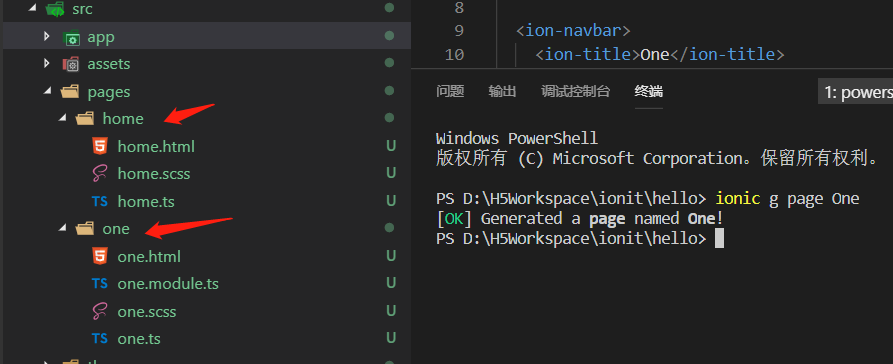
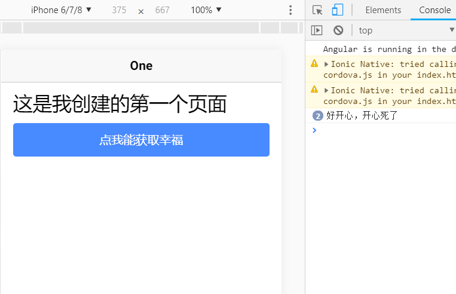

官网介绍 [IonicPage](https://ionicframework.com/docs/api/navigation/IonicPage/) <br>

## 生成页面
创建一个页面的命令：`ionic g page One` <br>
该命令将会在项目的 src/pages 下自动生成一个以 One 命名的页面。它是一个文件夹，并包含4个文件。


上图中表示当前项目有两个页面，home页面 是在创建项目时自动生成的页面。可以发现他内部只有3个文件，而自动生成的 one页面 多了一个`one.module.ts`，后边解释。

## 页面URL声明与注册页面
页面处理基于URL。这个URL相当于页面对外的一张名片，类似于 Vue的路由。
* 在`xxx.module.ts`中声明页面，并在页面模块中导入深层链接的页面

```ts
<!-- one.module.ts -->

// 导入 angular模块
import { NgModule } from '@angular/core';
// 导入 ionic页面模块
import { IonicPageModule } from 'ionic-angular';
// 导入 页面，对应 one.ts。OnePage 是 one.ts 的 类名称。
import { OnePage } from './one';

@NgModule({
  // 声明类。这是一个数组，支持多个页面的类声明。
  declarations: [
    OnePage,
  ],
  // 在页面模块中添加该页面的类，以后使用该页面时就不需要import了。同样这是个数组
  imports: [
    IonicPageModule.forChild(OnePage),
  ],
})
export class OnePageModule {}
```

* 将 一个空的 `@IonicPage` 装饰器 添加到组件。这将自动创建指向组件的链接：`name: 'OnePage'` 。

```
<!-- one.ts -->

import { Component } from '@angular/core';
import { IonicPage } from 'ionic-angular';

@IonicPage()
@Component({
  selector: 'page-one',
  templateUrl: 'one.html',
})
```

?> `@IonicPage`装饰接受一个`DeepLinkMetadataType`对象。此对象接受以下属性：name，segment，defaultHistory，和priority。可用于创建复杂的导航链接。例如：

```
@IonicPage({
  name: 'first-page',
  segment: 'first' // 
})

// home.ts
go2OnePage() {
  // this.navCtrl.push('OnePage');
  this.navCtrl.push('first-page');
}
```

## 展示一些内容
随便写的一点东西，可略过。


```html
<!-- one.html -->

<!-- 导航栏，可以去掉 -->
<ion-header>
  <ion-navbar>
    <ion-title>One</ion-title>
  </ion-navbar>
</ion-header>

<ion-content padding>
  <h1>这是我创建的第一个页面</h1>
  <button ion-button block class="one-btn" (click)="happy()">点我能获取幸福</button>
</ion-content>
```

```scss
<!-- one.scss -->

page-one {
  .one-btn {
    font-size: 16px;
    color: blue;
    border-radius: 4px
  }
}
```

```ts
<!-- one.ts -->

import { Component } from '@angular/core';
import { IonicPage, NavController, NavParams } from 'ionic-angular';

@IonicPage(
  {
    name: 'first-page',
    segment: 'first' // http://localhost:8100/#/first 默认是  http://localhost:8100/#/one
  }
)
@Component({
  selector: 'page-one',
  templateUrl: 'one.html',
})
export class OnePage {

  constructor(public navCtrl: NavController, public navParams: NavParams) {}

  ionViewDidLoad() {}

  happy() {
    console.log('好开心，开心死了');
  }

}
```


